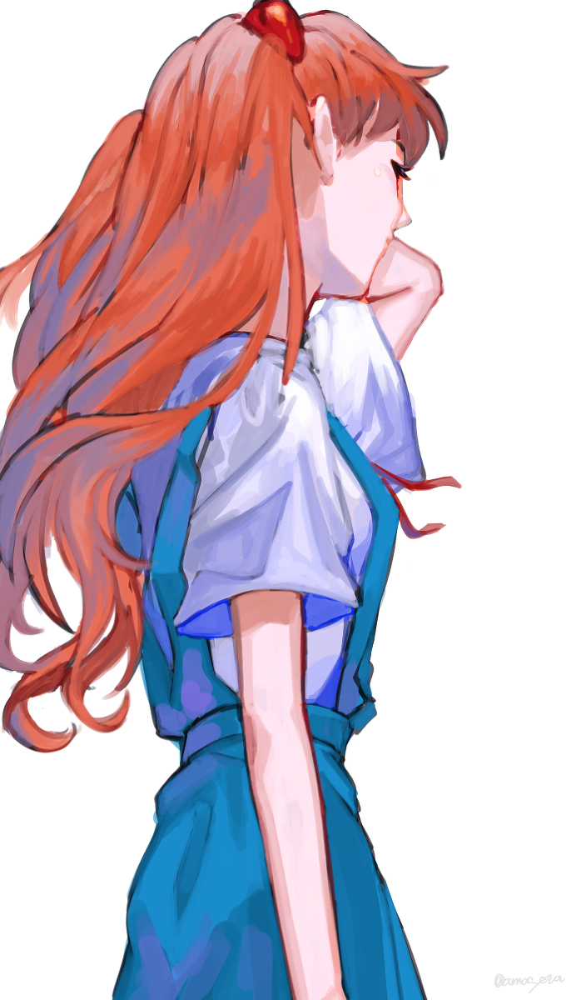
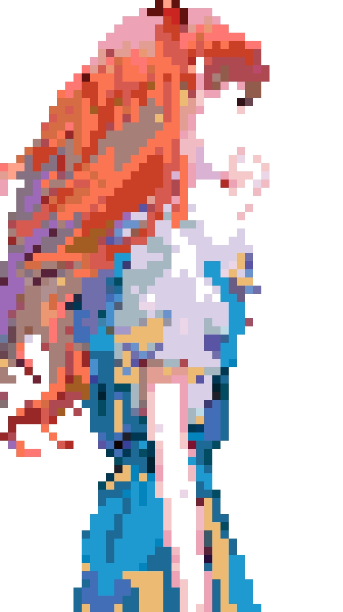
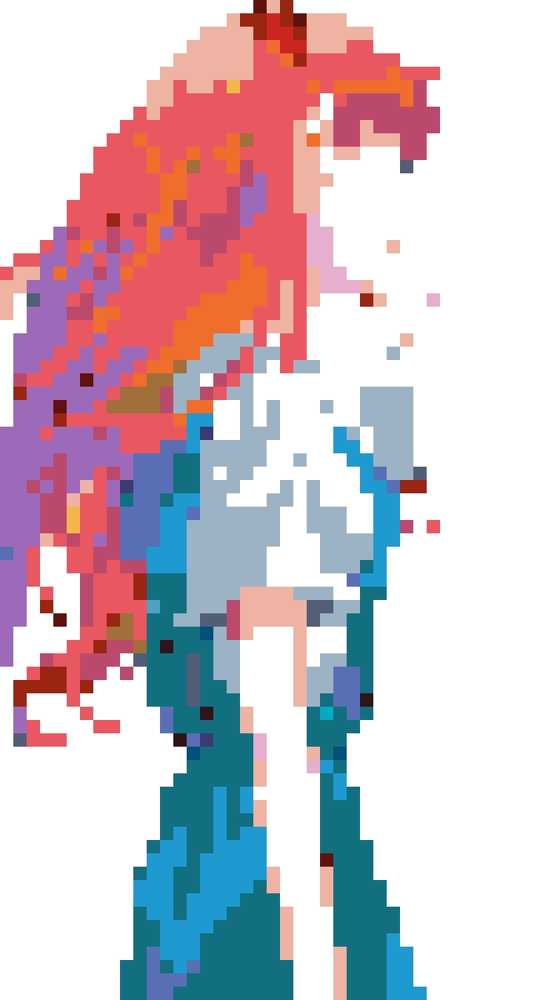
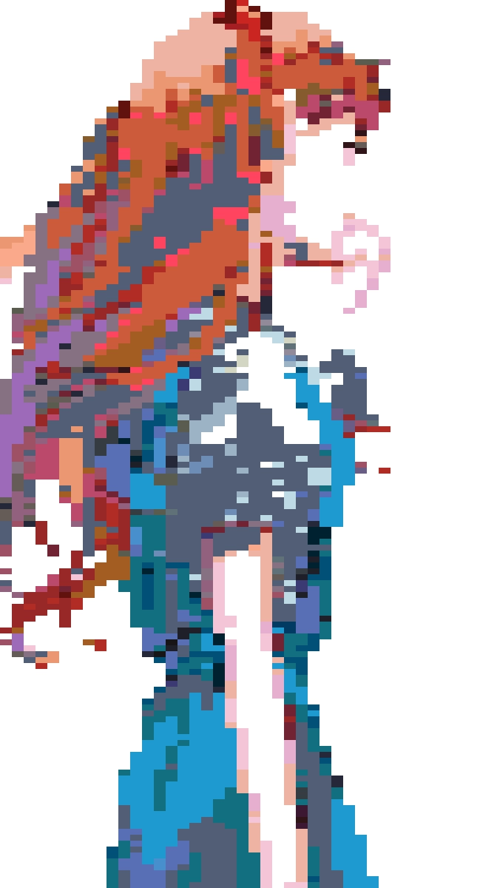

# Mosaic Filter

1. Splits the target image into tiles.
2. Replaces each tile with the sample whose RGB histogram is closet to it in the image set.
3. Generates the filtered image.

### Prerequisite:
- Python 3.X
- OpenCV

### Instruction
In terminal:
- --help
: show this help message and exit
- --i TARGETFILE
: path to the target file, required
- --sample SAMPLEFILE
: path to the sample set, default "./color_set", **the RGB_generator.py in the same directory could be used to generate image based on its color code**
- --type FILETYPE
: type of the image in the sample set, default ".jpg"
- --height HEIGHT
: height of the tile, default 16
- --width WIDTH
: width of the tile, default 16
- --o OUTFILE
: path to the output file, default "out.jpg"
- --bins BINS
: number of bins used for calculating RGB histogram, default 8
- --opt OPTION
: method used for calculating histogram differences, default "correlation". Other options are "chi-squared", "intersection" and "hellinger"

### Demo
###### Original image

Image via
[Amoc](https://www.pixiv.net/en/artworks/81363989)
, PIXIV ID: 4093391
###### Filtered with default setting

###### bins = 4

###### height = 8

###### width = 8

###### option = "hellinger"

### Reference
- https://www.pyimagesearch.com/2014/07/14/3-ways-compare-histograms-using-opencv-python/
- https://www.pyimagesearch.com/2014/01/22/clever-girl-a-guide-to-utilizing-color-histograms-for-computer-vision-and-image-search-engines/